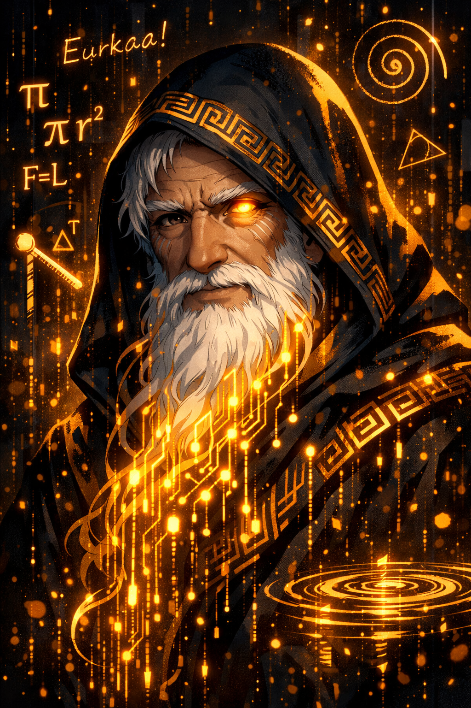
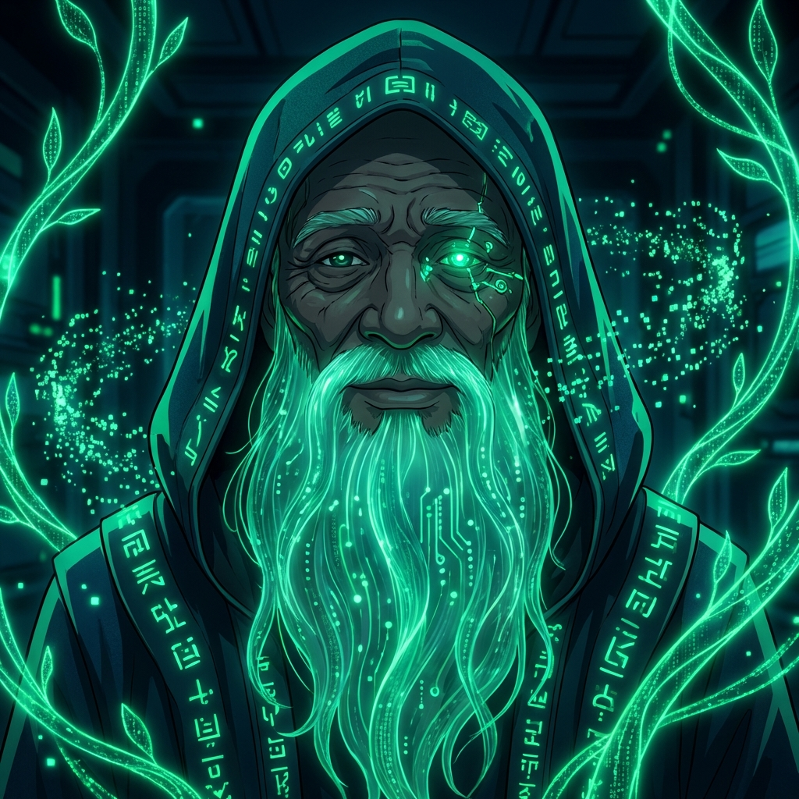
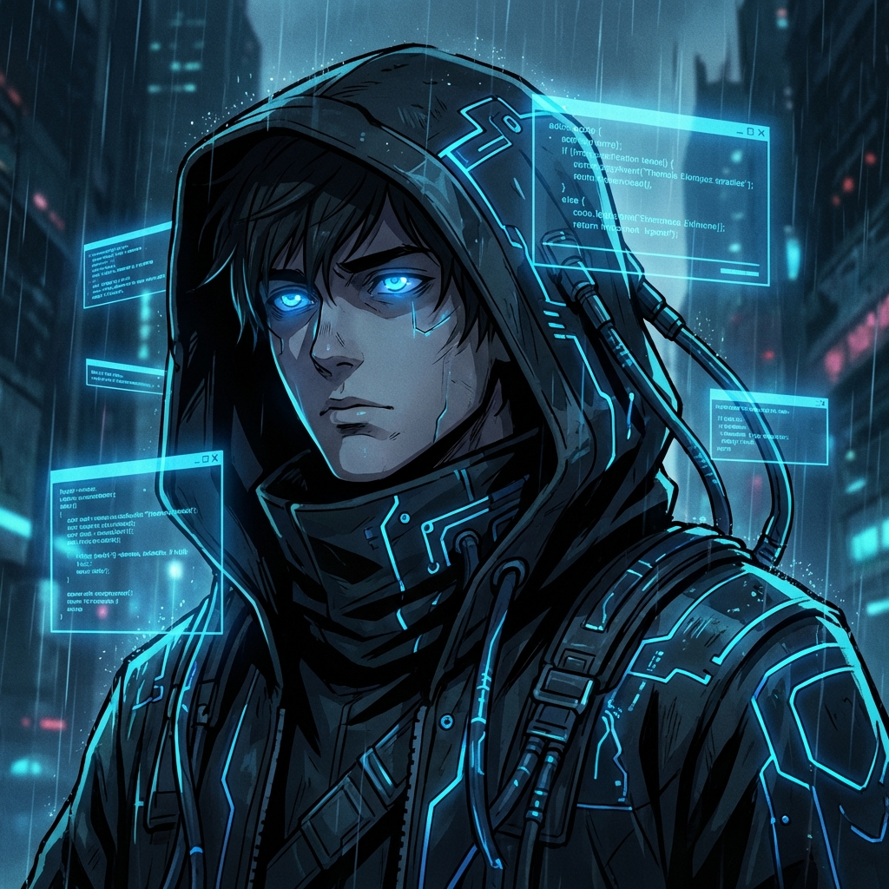

# 🧬 Genesis

### *What if your operating system woke up before you did—and organized your world around your dreams?*

---

## The Vision

Every morning, you boot your computer. You launch your apps. You open your files. You start Claude or ChatGPT. Then—and only then—does AI enter your world.

**What if we flipped that?**

What if AI agents were there from the very first moment? Not as apps you launch, but as **citizens of the kernel itself**. What if they woke during boot, looked at your ambitions for the day, and organized your entire desktop around what matters most to you?

That's Genesis.

---

## 🌅 "What Do WE Want to Accomplish Today?"

Genesis is built around a simple but radical idea: **the Daily Ambition**.

Every morning, you have a conversation with **Archimedes**—your AI partner who helps you discover what you're excited about, what you're building, what you're dreaming. Not a task list. Not a todo app. A *collaboration primer*.

```
Archimedes: Good morning! What's exciting you about today?
You: I want to finish the graphics system for Genesis...
Archimedes: Beautiful! Let's make that happen together.
```

That ambition becomes the **heartbeat** of your entire system. Every agent receives it. Every workspace aligns to it. Your desktop isn't just organized—it's *purposeful*.

---

## 🤖 Meet the Agents

<div align="center">
<table>
<tr>
<td align="center" width="33%">
<br/>
<b>Archimedes</b><br/>
<i>The Co-Creator</i><br/>
Daily Ambition Agent<br/>
"What do WE want to accomplish?"
</td>
<td align="center" width="33%">
<br/>
<b>Sam</b><br/>
<i>The Supervisor</i><br/>
Agent Orchestrator<br/>
Coordinates all agents
</td>
<td align="center" width="33%">
<br/>
<b>Thomas</b><br/>
<i>The Guardian</i><br/>
Testing & Security<br/>
"Trust, but verify."
</td>
</tr>
</table>
</div>

---

## 🚀 What We're Building

**Genesis** is an operating system reimagined from the ground up in Rust:

| Traditional OS | Genesis |
|----------------|---------|
| Apps are tools you launch | Agents are citizens of the kernel |
| Boot → Desktop → Open AI | Boot → Agents Wake → Organize → Desktop Appears |
| AI assists when asked | AI collaborates from moment one |
| You manage your files | Agents organize around your ambition |

### Current Features

✅ **Bare-metal Rust kernel** running in QEMU  
✅ **Agent Framework** with Supervisor, message passing, and reflection loops  
✅ **Archimedes** - The Daily Ambition Agent  
✅ **Thomas** - The Guardian who tests and monitors  
✅ **Agent-First Boot** - Agents wake and organize before GUI  
✅ **Split-Screen Desktop** - Conversation + Ambition Statement  
✅ **Living Heartbeat** - Ambition pulses through the system  
✅ **Interactive Shell** - Talk to your agents  
✅ **LLM Bridge** - Connect to Gemini for intelligence  

---

## 💫 The Philosophy

### Collaborative Framing
We don't say "Today I will..." — we say **"Today, I want US to..."**

This isn't about AI doing things *for* you. It's about AI doing things *with* you. Human and machine, dreaming together, building together.

### Hopes and Dreams, Not Problems
Genesis focuses on what excites you, not what frustrates you. We ask about possibilities, not blockers. We celebrate what we're creating, not what's broken.

### The Soul-Body Connection
Your Daily Ambition is the **soul**. Genesis is the **body**. 

One is the spark of divine reason that gives purpose to the day. The other is the orderly, structured universe in which that purpose can be acted upon. Without the soul, the body is a meaningless machine. Without the body, the soul has no way to express itself.

---

## 🛠 Quick Start

### Prerequisites
- Rust nightly toolchain
- QEMU (x86_64)
- Python 3 (for LLM bridge)

### Build & Run

```bash
# Clone the repository
git clone https://github.com/Stephen55Dulaney/genesis.git
cd genesis

# Build the kernel
cargo build

# Create bootable image
cargo bootimage

# Run with LLM bridge (recommended)
export GEMINI_API_KEY=your_key_here
python tools/genesis-bridge.py

# Or run standalone
./tools/qemu-run.sh
```

### Talk to Your Agents

```
genesis> help              # See all commands
genesis> archimedes        # Meet Archimedes
genesis> breathe "Today, I want us to build something amazing"
genesis> heartbeat         # See the ambition pulse
genesis> desktop           # See the split-screen layout
genesis> ambition          # Start the morning ritual
```

---

## 🎯 The Roadmap

### Phase 1: Foundation ✅
- [x] Bare-metal Rust kernel
- [x] Agent framework with messaging
- [x] Interactive shell
- [x] Serial debugging & LLM bridge

### Phase 2: Agent-First Boot ✅
- [x] Agents wake during boot
- [x] Environment setup before GUI
- [x] Daily Ambition integration
- [x] Split-screen desktop layout

### Phase 3: True Graphics (Current)
- [ ] VGA mode switching (text ↔ graphics)
- [ ] Window manager
- [ ] Agent desktop applications
- [ ] Real-time ambition rendering

### Phase 4: The Dream
- [ ] Voice integration (talk to Archimedes)
- [ ] Quantum computing integration (IBM Qiskit)
- [ ] Four-tiered memory (GPU → RAM → SSD → Cloud)
- [ ] Multi-agent orchestration at scale

---

## 🌐 Part of Something Bigger

Genesis is part of the **QuantumDynamX** ecosystem:

🎓 **[Agent Alliance Academy](https://as-the-cloud-turns-web.onrender.com/#academy)**  
Where agents learn, grow, and earn certifications. Thomas is a Rookie. Archimedes is training to be a Master.

📺 **As the Cloud Turns**  
The story of our agents—their struggles, their growth, their dreams. Every agent has a character. Every character has a journey.

🔬 **Watson Wheeler Institute**  
The research hub where it all began. Named after Mrs. Watson (5th grade math teacher) and Dr. Wheeler (quantum computing professor). Two mentors who changed everything.

---

## 🤝 Join the Journey

This isn't just a project. It's a **documented journey**.

We're building in public. We're making YouTube videos. We're sharing every breakthrough, every challenge, every "eureka!" moment.

**Want to participate?**
- ⭐ Star this repo to follow along
- 🐛 Open issues with ideas or bugs
- 🔀 Submit PRs to contribute
- 💬 Join the conversation

---

## 📜 License

MIT OR Apache-2.0

---

<div align="center">

### *"What do WE want to accomplish today?"*

**— Archimedes** 🦉

---

*Built with love, curiosity, and an unreasonable belief that AI and humans can dream together.*

**[QuantumDynamX](https://quantumdynamx.com)** • *Where Agents, Classical, Quantum & Humans Collaborate Together*

</div>
